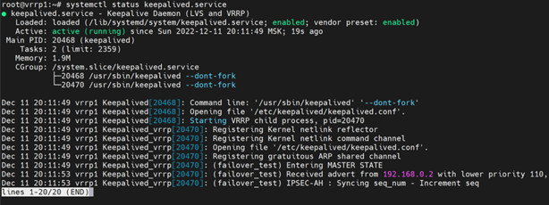
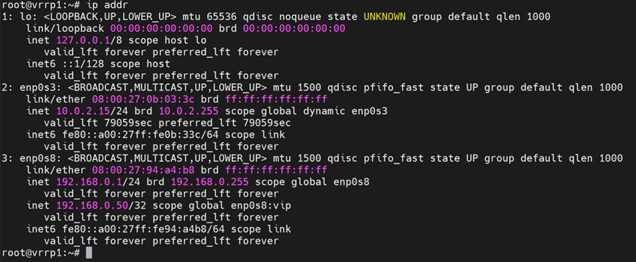

# Домашнее задание к занятию "10.1. Keepalived/vrrp" - `Юрий Чеканов`

---

### Задание 1. 

Требуется развернуть топологию из лекции и выполнить установку и настройку сервиса Keepalived. 

*Пришлите  конфигурацию сервисов для каждой ноды.   
 Скриншот вывода команды  ip address.*

---

***instance 1:***

```ini
vrrp_instance failover_test {
state MASTER
interface enp0s8
virtual_router_id 10
priority 255
advert_int 4
authentication {
auth_type AH
auth_pass 1111
}
unicast_src_ip 192.168.0.1
unicast_peer {
192.168.0.2
}
virtual_ipaddress {
192.168.0.50 dev enp0s8 label enp0s8:vip
}
}
```




 
### Задание 2*.

Проведите тестирование работы ноды, когда один из интерфейсов выключен. Для этого:
- добавьте еще одну виртуальную машину и включите ее в сеть;
- на машине установите wireshark и запустите процесс прослеживания интерфейса;
- запустите процесс ping на виртуальный хост;
- выключите интерфейс на одной ноде (мастер), остановите wireshark;
- найдите пакеты ICMP, в которых будет отображён процесс изменения MAC адреса одной ноды на другой. 

 *Пришлите скриншот до и после выключения интерфейса из Wireshark.*