# Домашнее задание к занятию "`10.4 Резервное копирование`" - `Юрий Чеканов`

---

### Задание 1
В чем отличие между:
* полное резервное копирование
* дифференциальное резервное копирование
* инкрементное резервное копирование
*Приведите ответ в свободной форме.*

**Full BackUp** делает полное копирование всего.
* Самый долгий с точки зрения процесса;
* Дает нагрузку на диски и на сеть, если она сетевая;
* Самый надежный и быстрый с точки зрения восстановления данных.

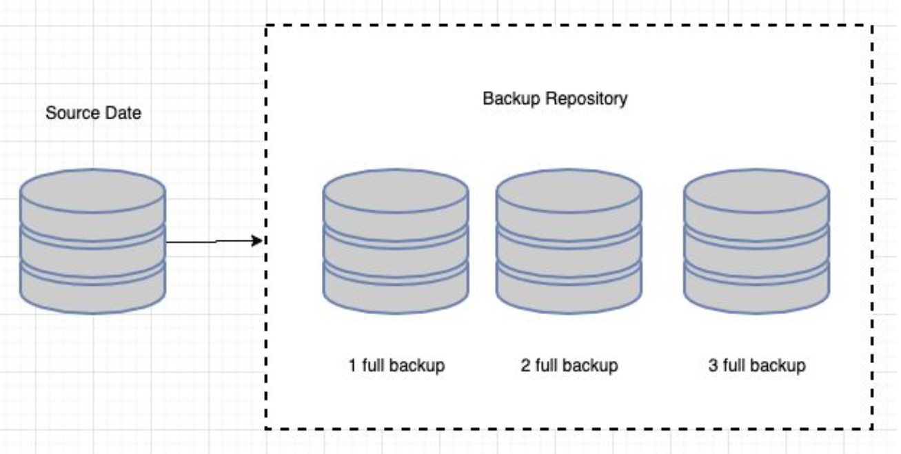


**Differential backup** - hезервное копирование быстрее, чем полное, но медленнее, чем инкрементное. Восстановление наоборот.
Памяти на определенный период меньше, чем у полного, но больше, чем у инкрементного .
Принцип работы:
* сначала делается полное резервное копирование,
* затем при каждом запуске процесса резервируются только измененные данные, но точкой отсчета является состояние времени полного бэкапа.

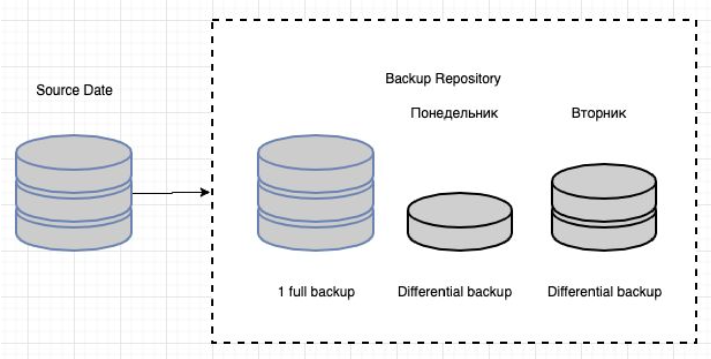


**Incremental backup** - работает как дифференцированное копирование, но в отличии от него бэкапятся данные, которые были изменены из последнего слепка, то есть отправная точка каждого нового бэкапа это бэкап n-1.

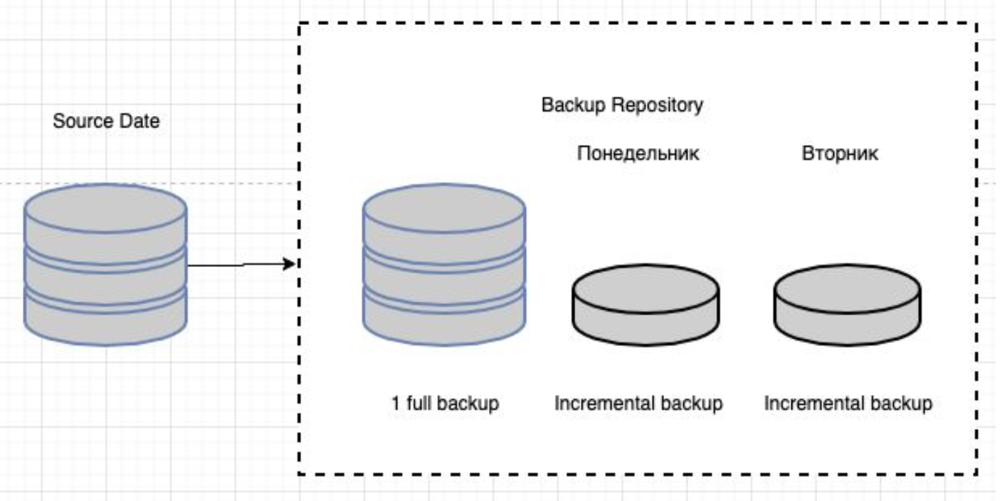

---

### Задание 2
Установите программное обеспечении Bacula, настройте bacula-dir, bacula-sd, bacula-fd. Протестируйте работу сервисов (трех сервисов).
*Пришлите скриншот рабочей конфигурации.*

`bacula-sd.conf`
```ini
Storage {                             # definition of myself
  Name = debian-sd
  SDPort = 9103                  # Director's port
  WorkingDirectory = "/var/lib/bacula"
  Pid Directory = "/run/bacula"
  Plugin Directory = "/usr/lib/bacula"
  Maximum Concurrent Jobs = 20
  SDAddress = 127.0.0.1
}

Director {
  Name = debian-dir
  Password = "_QSKLCwq58Mwr7ZGo7JSvdlENy1Ye4jXF"
}

Director {
  Name = debian-mon
  Password = "45Ov0tuCabcj6ASGy19f-ZpYPz0fTotmI"
  Monitor = yes
}

Autochanger {
  Name = FileChgr1
  Device = FileChgr1-Dev1, FileChgr1-Dev2
  Changer Command = ""
  Changer Device = /dev/null
}

Device {
  Name = FileChgr1-Dev1
  Media Type = File1
  Archive Device = /backup/files1
  LabelMedia = yes;                   # lets Bacula label unlabeled media
  Random Access = Yes;
  AutomaticMount = yes;               # when device opened, read it
  RemovableMedia = no;
  AlwaysOpen = no;
  Maximum Concurrent Jobs = 1
}

Device {
  Name = FileChgr1-Dev2
  Media Type = File1
  Archive Device = /backup/files2
  LabelMedia = yes
  Random Access = Yes
  AutomaticMount = yes
  RemovableMedia = no
  AlwaysOpen = no
  Maximum Concurrent Jobs = 1
}

Messages {
  Name = Standard
  director = debian-dir = all
}
```
`bacula-fd.conf`
```ini
Director {
  Name = debian-dir
  Password = "iiJZuW7M8NVv9L91a8KVIytc1cMOesUSh"
}

Director {
  Name = debian-mon
  Password = "WkKWk4l_XHQg8vbGaEeEj9vBBvdzOEHIx"
  Monitor = yes
}

FileDaemon {                          # this is me
  Name = debian-fd
  FDport = 9102                  # where we listen for the director
  WorkingDirectory = /var/lib/bacula
  Pid Directory = /run/bacula
  Maximum Concurrent Jobs = 20
  Plugin Directory = /usr/lib/bacula
  FDAddress = 127.0.0.1
}

Messages {
  Name = Standard
  director = debian-dir = all, !skipped, !restored
}
```
`bacula-dir.conf`
```ini
Director {                            # define myself
  Name = debian-dir
  DIRport = 9101                # where we listen for UA connections
  QueryFile = "/etc/bacula/scripts/query.sql"
  WorkingDirectory = "/var/lib/bacula"
  PidDirectory = "/run/bacula"
  Maximum Concurrent Jobs = 20
  Password = "999"         # Console password
  Messages = Standard
  DirAddress = 127.0.0.1
}

JobDefs {
  Name = "DefaultJob"
  Type = Backup
  Level = Incremental
  Client = debian-fd
  FileSet = "BackUpFileSet"
  Schedule = "WeeklyCycle"
  Storage = debian-sd
  Messages = Standard
  Pool = LocalPool
  SpoolAttributes = yes
  Priority = 10
  Write Bootstrap = "/var/lib/bacula/%c.bsr"
}

Storage {
  Name = debian-sd
  Address = 127.0.0.1
  SDPort = 9103
  Password = "_QSKLCwq58Mwr7ZGo7JSvdlENy1Ye4jXF"
  Device = FileChgr1
  Media Type = File1
  Maximum Concurrent Jobs = 1
}

FileSet {
  Name = "BackUpFileSet"
  Include {
    Options {
      signature = MD5
      Compression = GZIP
    }
    File = /etc
  }
#  Exclude {
#    File = /var/lib/bacula
#    File = /nonexistant/path/to/file/archive/dir
#    File = /proc
#    File = /tmp
#    File = /sys
#    File = /.journal
#    File = /.fsck
#  }
}

FileSet {
  Name = "Catalog"
  Include {
    Options {
    signature = MD5
    }
  File = /var/lib/bacula/bacula.sql
  }
}

Client {
  Name = debian-fd
  Address = localhost
  FDPort = 9102
  Catalog = MyCatalog
  Password = "iiJZuW7M8NVv9L91a8KVIytc1cMOesUSh"          # password for FileDaemon
  File Retention = 60 days            # 60 days
  Job Retention = 6 months            # six months
  AutoPrune = yes                     # Prune expired Jobs/Files
}

Schedule {
  Name = "WeeklyCycle"
  Run = Full 1st sun at 23:05
  Run = Differential 2nd-5th sun at 23:05
  Run = Incremental mon-sat at 23:05
}

Schedule {
  Name = "WeeklyCycleAfterBackup"
  Run = Full sun-sat at 23:10
}

Catalog {
  Name = MyCatalog
  dbname = "bacula"; DB Address = "localhost"; dbuser = "bacula"; dbpassword = "root"
}

Messages {
  Name = Standard
  director = debian-dir = all, !skipped, !restored
}

Pool {
  Name = LocalPool
  Pool Type = Backup
  Recycle = yes                       # Bacula can automatically recycle Volumes
  AutoPrune = yes                     # Prune expired volumes
  Volume Retention = 365 days         # one year
  Maximum Volume Bytes = 5G          # Limit Volume size to something reasonable
  Maximum Volumes = 100               # Limit number of Volumes in Pool
  Label Format = "Local-"
}

Job {
  Name = "LocalBackup"
  JobDefs = "DefaultJob"
  Enabled = yes
  FileSet = "BackUpFileSet"
  Schedule = "WeeklyCycle"
  Storage = debian-sd
  Pool = "LocalPool"
}

Job {
  Name = "BackupCatalog"
  JobDefs = "DefaultJob"
  Level = Full
  FileSet = "Catalog"
  Schedule = "WeeklyCycleAfterBackup"
  # This creates an ASCII copy of the catalog
  # Arguments to make_catalog_backup.pl are:
  #  make_catalog_backup.pl <catalog-name>
#  RunBeforeJob = "/etc/bacula/scripts/make_catalog_backup.pl MyCatalog"
  # This deletes the copy of the catalog
#  RunAfterJob  = "/etc/bacula/scripts/delete_catalog_backup"
  Write Bootstrap = "/var/lib/bacula/%n.bsr"
  Priority = 11                   # run after main backup
}

Console {
  Name = debian-mon
  Password = "zbA30RkblgoW0FLxVL9odnBWAESbAUobR"
  CommandACL = status, .status
}
```
`bconsole.conf`
```ini
Director {
  Name = debian-dir
  DIRport = 9101
  address = localhost
  Password = "999"
}
```

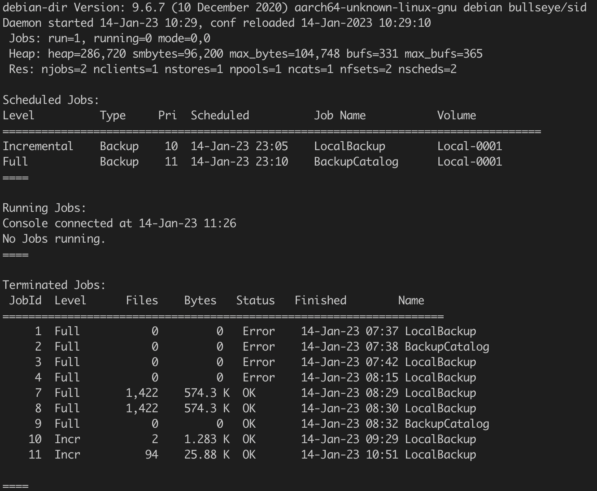
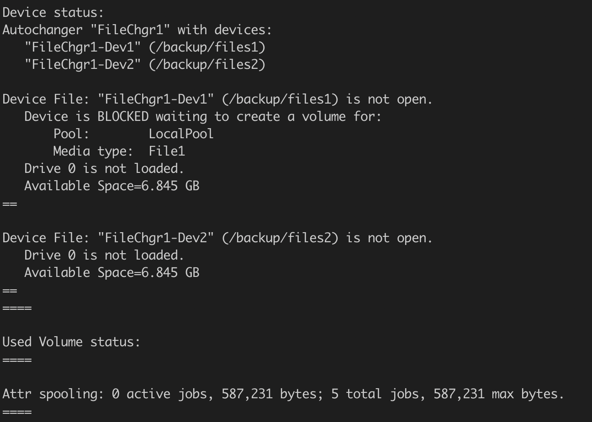
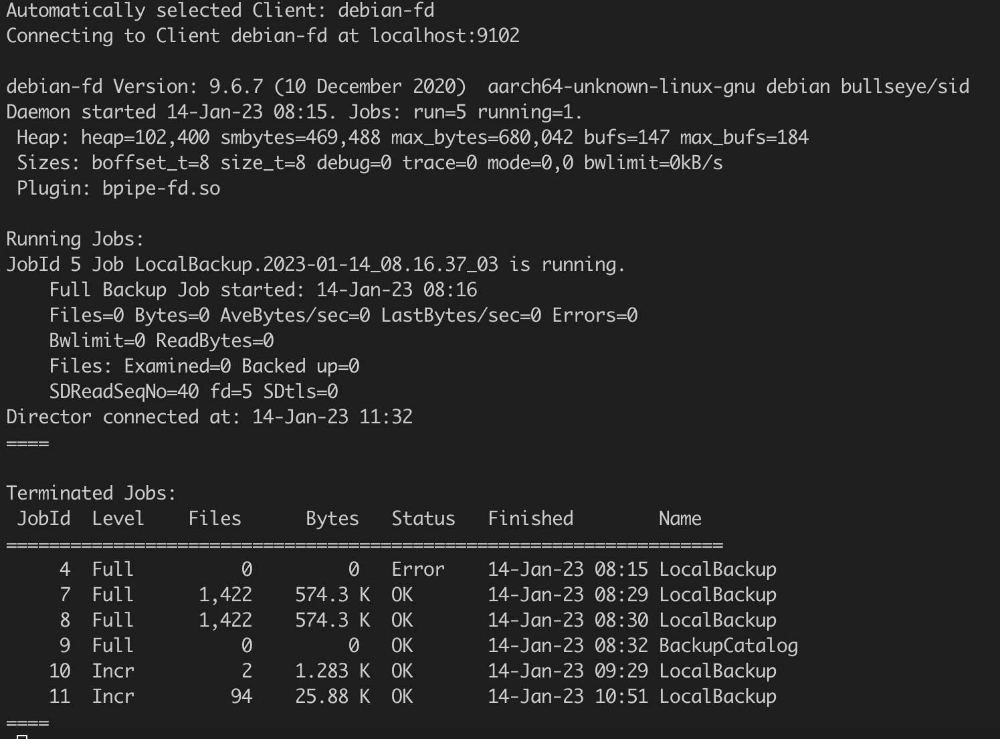
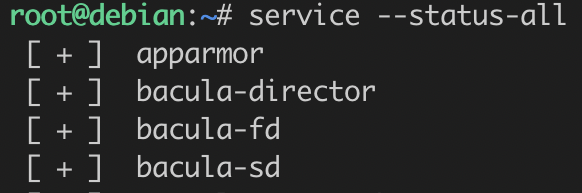
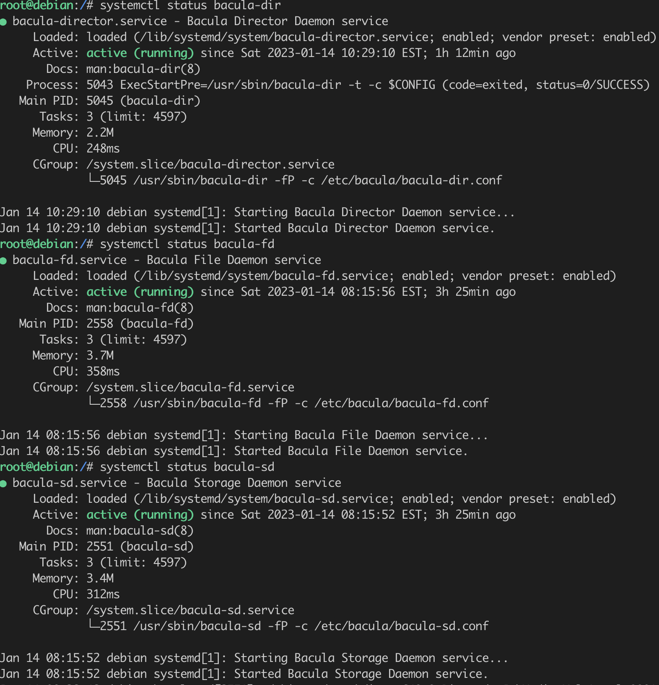

---

### Задание 3
Установите программное обеспечении rsync. Настройте синхронизацию на двух нодах. Протестируйте работу сервиса.

*Пришлите скриншот рабочей конфигурации.*

`rsyncd.conf` 
```ini
pid file = /var/run/rsyncd.pid
log file = /var/log/rsyncd.log
transfer logging = true
munge symlinks = yes

[data]
path = /etc
uid = root
read only = yes
list = yes
comment = Data backup Dir
auth users = backup
secrets file = /etc/rsyncd.scrt
```

`backup-node1.sh`
```bash
#!/bin/bash
date
# Папка, куда будем складывать архивы — ее либо сразу создать либо не создавать а положить в уже существующие
syst_dir=/backup/
# Имя сервера, который архивируем
srv_name=debian
# Адрес сервера, который архивируем
srv_ip=192.168.64.2
srv_user=backup
# Ресурс на сервере для бэкапа
srv_dir=data
echo "Start backup ${srv_name}"
# Создаем папку для инкрементных бэкапов
mkdir -p ${syst_dir}${srv_name}/increment/
/usr/bin/rsync -avz --progress --delete --password-file=/etc/rsyncd.scrt ${srv_user}@${srv_ip}::${srv_dir} ${syst_dir}${srv_name}/current/ --backup --backup-dir=${syst_dir}${srv_name}/increment/`date +%Y-%m-%d`/

# Чистим папки с инкрементными архивами старше 30-ти дней
/usr/bin/find ${syst_dir}${srv_name}/increment/ -maxdepth 1 -type d -mtime +30 -exec rm -rf {} \;

date
echo "Finish backup ${srv_name}"
```
Результат работы скрипта при инкрементном резерваровании:

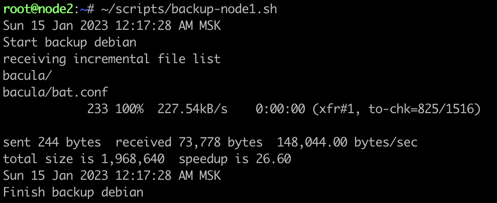

Полное и инкрементное резервирование работает: 

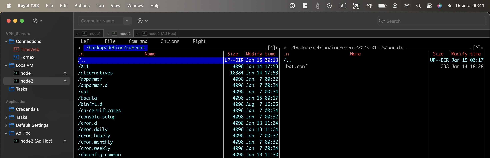

---

### Задание 4*
Настройте резервное копирование двумя (или более) методами, используя одну из рассмотренных команд для папки /etc. Проверьте резервное копирование.
`Пришлите скриншот рабочей конфигурации результат выполнения.`

Config files were shown in second solution.
Baculas list of Jobs: 

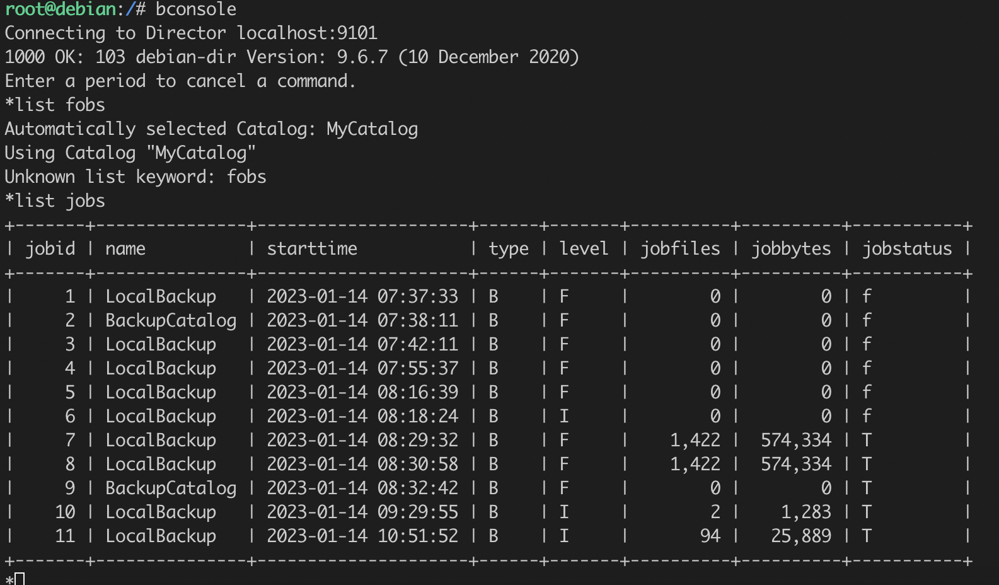
