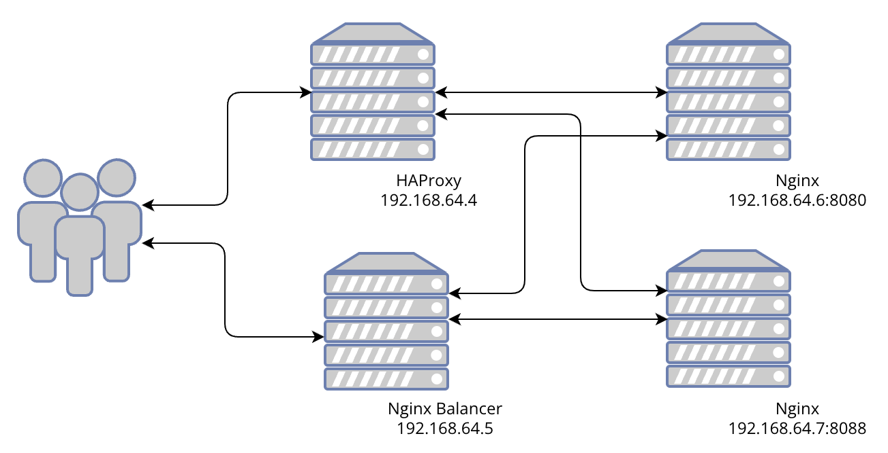
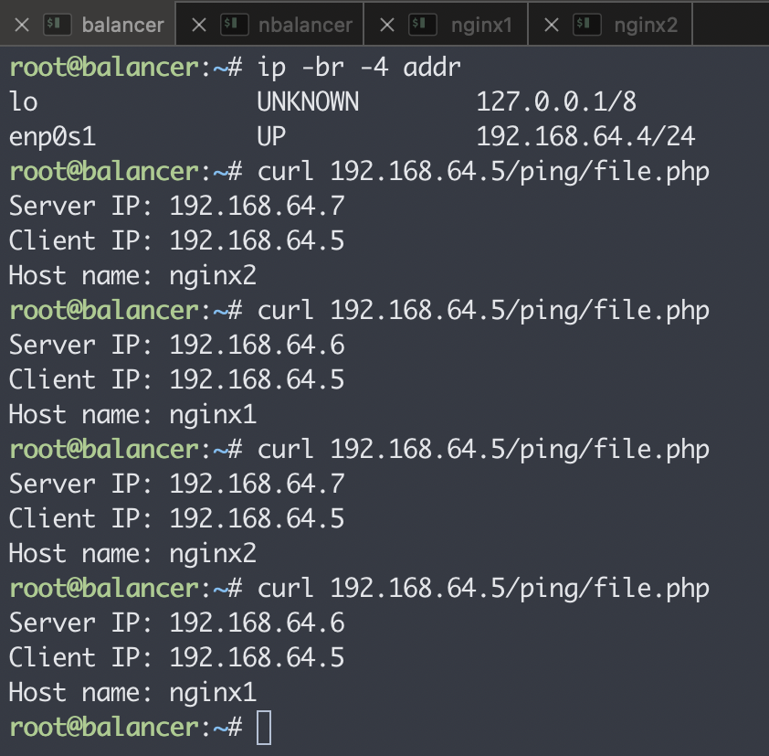
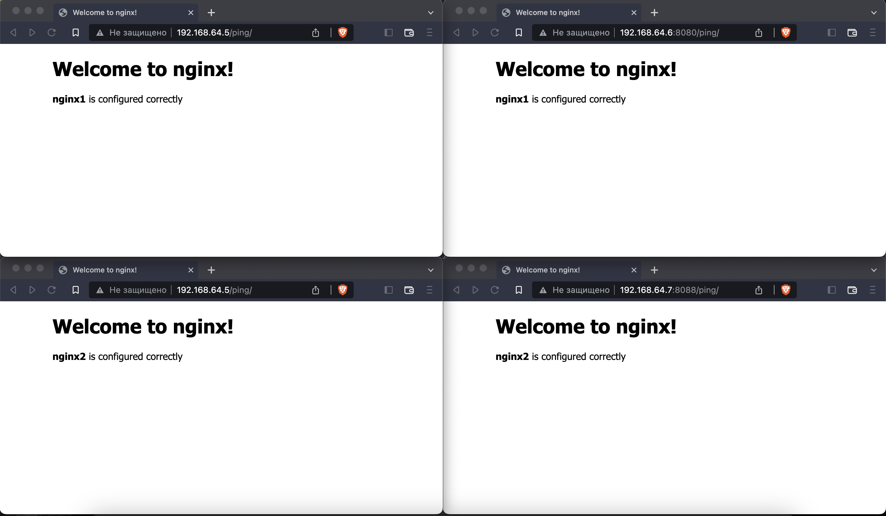
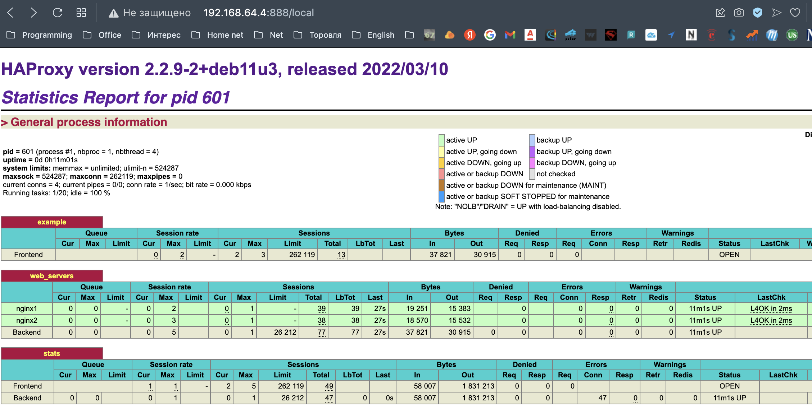
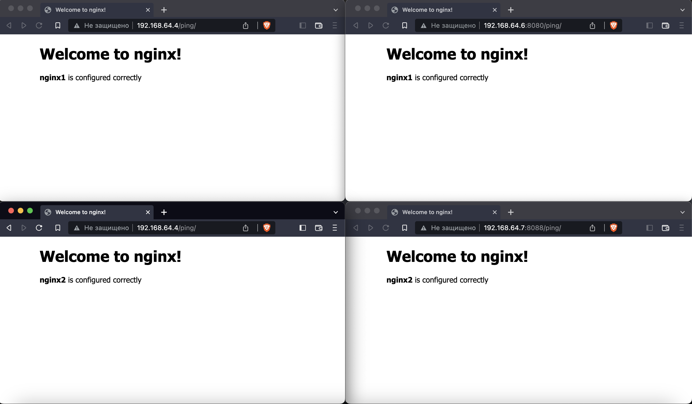

# Домашнее задание к занятию "`10.5 Балансировка нагрузки. HAProxy/Nginx`" - `Юрий Чеканов`

---

### Задание 1
Что такое балансировка нагрузки и зачем она нужна?

*Приведите ответ в свободной форме*

**Балансировка нагрузки** (*load balancing*) — это процесс распределения нагрузки на пул серверов.
Распределение происходит на L4(Транспортный) или L7(Прикладной) уровнях модели OSI.
Какие преимущества дает балансировка нагрузки: ● сокращение времени простоя,
* масштабируемость,
* отказоустойчивость.

**Балансировщик нагрузки** — это сервис, который занимается распределением нагрузки между пулом приложений, которые находятся за ним, стараясь максимизировать скорость и утилизировать ресурсы приложений. Также, гарантирует, что приложения не будут перегружены.
Существуют *hardware* и *software* решения.


---

### Задание 2
Чем отличаются между собой алгоритмы балансировки round robin и weighted round robin? В каких случаях каждый из них лучше применять?

*Приведите ответ в свободной форме*

**Round Robin**
Запросы распределяются по пулу сервером последовательно.
Если в пуле все сервера одинаковой мощности, то этот алгоритм скорее всего подойдет идеально.


**Weighted Round Robin**
Тот же round robin, но имеет дополнительное свойство — вес сервера. 
С его помощью мы можем указать балансировщику, сколько трафика отправлять на тот или иной сервер. 
Так сервера помощнее будут иметь больший вес и, соответственно, обрабатывать больше запросов, чем другие сервера.


---

### Задание 3
Установите и запустите haproxy.

*Приведите ответ в свободной форме*


---


### Задание 4
Установите и запустите nginx.

*Приведите ответ в свободной форме*


---

### Задание 5
Настройте nginx на виртуальной машине таким образом, чтобы при запросе:

curl http://localhost:8088/ping

он возвращал в ответе строчку:

"nginx is configured correctly"

*Приведите скриншот получившейся конфигурации*

Для закрепления материала был построен тестовая сеть из 4х серверов:



на web серверах размещен **file.php** :
```php
<?php
header('Content-Type: text/plain');
echo "Server IP: ".$_SERVER['SERVER_ADDR'];
echo "\nClient IP: ".$_SERVER['REMOTE_ADDR'];
echo "\nHost name: ";
echo gethostname();
echo "\n";
?>
```
и **index.html** :
```html
<!DOCTYPE html>
<html>
<head>
<title>Welcome to nginx!</title>
<style>
    body {
        width: 35em;
        margin: 0 auto;
        font-family: Tahoma, Verdana, Arial, sans-serif;
    }
</style>
</head>
<body>
<h1>Welcome to nginx!</h1>
<p><b>nginx2</b> is configured correctly</p>
</body>
</html>
```
 
В этом задании дополнительно был настроен простейший вариант балансировщика nginx.  
Конфигурация балансировщика nginx на 192.168.64.5 :

**/etc/nginx/nginx.conf**
```ini
user www-data;
worker_processes auto;
pid /run/nginx.pid;
include /etc/nginx/modules-enabled/*.conf;

events {
        worker_connections 768;
        multi_accept off;
}


http {
   upstream myapp{
      server 192.168.64.6:8080;
      server 192.168.64.7:8088;
   }
  include /etc/nginx/sites-enabled/*;
}
```

**/etc/nginx/sites-enabled/default**
```ini
server {
      listen 80;

      server_name mydomain.com;

      location / {

          proxy_pass http://myapp;


          proxy_redirect off;
          proxy_http_version 1.1;
          proxy_set_header Upgrade $http_upgrade;
          proxy_set_header Connection "upgrade";
      }
}
```
Тестирование работы балансировщика:





---

### Задание 6
Настройте haproxy таким образом, чтобы при ответе на запрос:

curl http://localhost:8080/

он проксировал его в nginx на порту 8088, который был настроен в задании 5 и возвращал от него ответ:

"haproxy is configured correctly".

*Приведите скриншот получившейся конфигурации*

**/etc/haproxy/haproxy.cfg**
```ini
global
        log /dev/log    local0
        log /dev/log    local1 notice
        chroot /var/lib/haproxy
        stats socket /run/haproxy/admin.sock mode 660 level admin expose-fd listeners
        stats timeout 30s
        user haproxy
        group haproxy
        daemon

defaults
        log     global
        mode    http
        option  httplog
        option  dontlognull
        timeout connect 5000
        timeout client  50000
        timeout server  50000
        errorfile 400 /etc/haproxy/errors/400.http
        errorfile 403 /etc/haproxy/errors/403.http
        errorfile 408 /etc/haproxy/errors/408.http
        errorfile 500 /etc/haproxy/errors/500.http
        errorfile 502 /etc/haproxy/errors/502.http
        errorfile 503 /etc/haproxy/errors/503.http
        errorfile 504 /etc/haproxy/errors/504.http

frontend example
        bind *:80
        default_backend web_servers

backend web_servers
        balance roundrobin
        server nginx1 192.168.64.6:8080 check
        server nginx2 192.168.64.7:8088 check

listen stats 
        bind            :::888
        mode            http
        stats           enable
        stats uri       /local
        stats refresh   15s
        stats realm     Haproxy\ Statistics
```
Haproxy Statistics:



Тестирование работы балансировщика:



