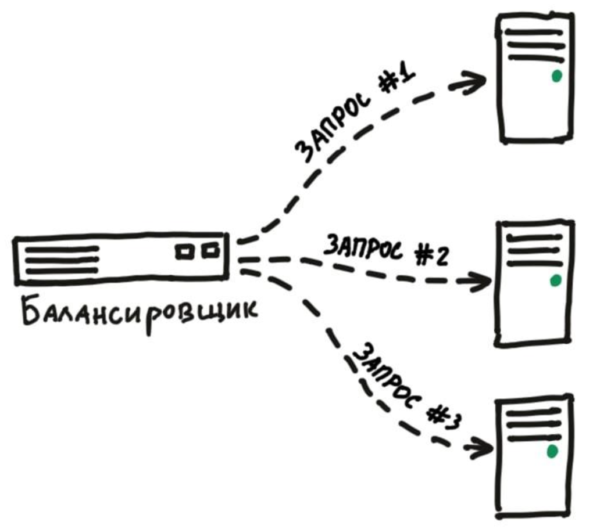

# Домашнее задание к занятию "`10.5 Балансировка нагрузки. HAProxy/Nginx`" - `Юрий Чеканов`

---

### Задание 1
Что такое балансировка нагрузки и зачем она нужна?

*Приведите ответ в свободной форме*

**Балансировка нагрузки** (*load balancing*) — это процесс распределения нагрузки на пул серверов.
Распределение происходит на L4(Транспортный) или L7(Прикладной) уровнях модели OSI.
Какие преимущества дает балансировка нагрузки: ● сокращение времени простоя,
* масштабируемость,
* отказоустойчивость.

**Балансировщик нагрузки** — это сервис, который занимается распределением нагрузки между пулом приложений, которые находятся за ним, стараясь максимизировать скорость и утилизировать ресурсы приложений. Также, гарантирует, что приложения не будут перегружены.
Существуют *hardware* и *software* решения.

---

### Задание 2
Чем отличаются между собой алгоритмы балансировки round robin и weighted round robin? В каких случаях каждый из них лучше применять?

*Приведите ответ в свободной форме*

**Round Robin**
Запросы распределяются по пулу сервером последовательно.
Если в пуле все сервера одинаковой мощности, то этот алгоритм скорее всего подойдет идеально.

**Weighted Round Robin**
Тот же round robin, но имеет дополнительное свойство — вес сервера. 
С его помощью мы можем указать балансировщику, сколько трафика отправлять на тот или иной сервер. 
Так сервера помощнее будут иметь больший вес и, соответственно, обрабатывать больше запросов, чем другие сервера.

---

### Задание 3
Установите и запустите haproxy.

*Приведите ответ в свободной форме*

---

### Задание 4
Установите и запустите nginx.

*Приведите ответ в свободной форме*

---

### Задание 5
Настройте nginx на виртуальной машине таким образом, чтобы при запросе:

curl http://localhost:8088/ping

он возвращал в ответе строчку:

"nginx is configured correctly"

*Приведите скриншот получившейся конфигурации*

---

### Задание 6
Настройте haproxy таким образом, чтобы при ответе на запрос:

curl http://localhost:8080/

он проксировал его в nginx на порту 8088, который был настроен в задании 5 и возвращал от него ответ:

"haproxy is configured correctly".

*Приведите скриншот получившейся конфигурации*
