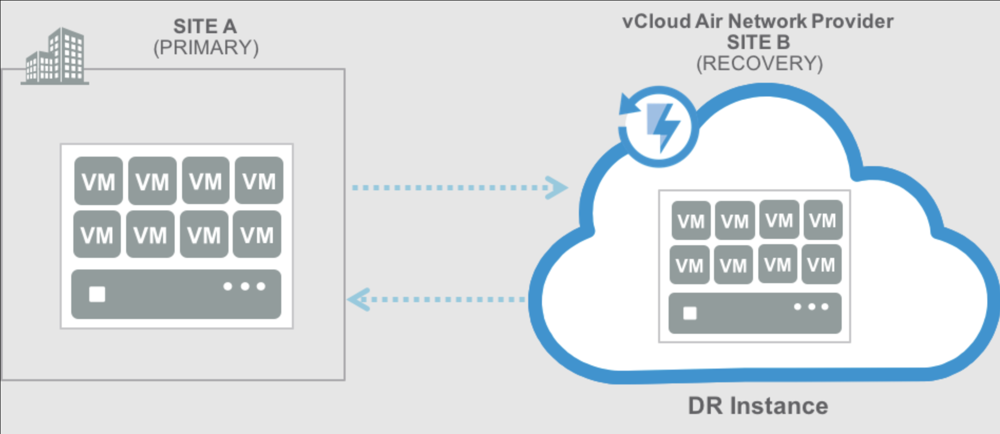

# Домашнее задание к занятию "`10.6 Disaster recovery`" - `Юрий Чеканов`


### Задание 1
В чём разница между DRaaS, BaaS, Active-Active, Active-Passive?  
`Приведите ответ в свободной форме.`  
Для начала дадим описание каждой модели: 

**DRaaS**  
	**Аварийное восстановление как услуга** (*DRaaS - Disaster-Recovery-as-a-Service*) — это модель сервиса  
облачных вычислений, которая позволяет организации выполнять резервное копирование данных и ИТ-инфраструктуры  
в стороннюю среду облачных вычислений. Это дает возможность восстановить доступ к ИТ-инфраструктуре  
и ее функциональность после аварии.  
	Модель «как услуга» означает, что самой организации не обязательно владеть всеми ресурсами или  
заниматься всеми процессами управления аварийным восстановлением. Вместо нее это может делать  
поставщик услуг.  

**Модели *DRaaS*:**  

*Управляемое решение DRaaS*: в рамках этой модели всю ответственность за аварийное восстановление  
берет на себя третья сторона. Выбирая этот вариант, организация должна поддерживать тесный контакт  
с поставщиком услуг DRaaS для гарантии того, что он будет в курсе всех изменений инфраструктуры,  
приложений и сервисов. Если вам не хватает опыта или времени для управления собственным процессом  
аварийного восстановления, для вас это будет лучшим вариантом.  

*Вспомогательное решение DRaaS*: если вы предпочитаете сохранить ответственность за определенные  
аспекты вашего плана аварийного восстановления либо если у вас есть уникальные или персонализированные  
приложения, которые может вызывать сложности для третьей стороны, лучшим вариантом будет вспомогательное  
решение DRaaS. В рамках этой модели поставщик услуг предлагает свои экспертные знания для оптимизации  
процедур аварийного восстановления, но заказчик несет ответственность за выполнение всего плана аварийного  
восстановления или отдельных его аспектов.  

*Решение DRaaS с функцией самообслуживания*: наименее затратный вариант — использование DRaaS с функцией  
самообслуживания, при котором заказчик несет ответственность за планирование, тестирование и администрирование  
аварийного восстановления, а также размещает собственную резервную копию инфраструктуры на виртуальных машинах  
в удаленном расположении. Требуются тщательное планирование и тестирование, чтобы убедиться, что средства  
обработки данных могут мгновенно переключиться на виртуальные серверы в случае аварии. Этот вариант лучше  
всего подходит тем, кто имеет в штате опытных экспертов по аварийному восстановлению.  
  

**Важные параметры работы системы аварийного восстановления:**
* Частота копирования — репликация данных происходит в режиме реального времени. От данного параметра зависит стоимость решения.  
* Актуальные и дискретные данные (RPO) — оперативный замер времени состоянии данных, которые фиксируются в последний момент работы системы.
* Скорость восстановления (RTO) — Время за которое можно будет уже выполнить восстановление системы после сбоя.
* Гибкость настройки — режим восстановления — может восстанавливать как всю инфраструктуру, так и отдельный сервер, отдельную программу на сервере или конфигурацию.
* Автоматизированность — репликация происходит или в заданный промежуток времени или синхронно
* Отказоустойчивость — зависит от сервиса, но как правило всевозможные технологии высокой доступности.

*Компании представляющие решения на рынке DRaas:*
[VMware](https://www.vmware.com/ru/topics/glossary/content/disaster-recovery-service-draas.html), [Acronics](https://www.acronis.com/en-us/products/cloud/cyber-protect/disaster-recovery/), [Veeam](https://www.veeam.com/ru/disaster-recovery-orchestrator.html), [CommVaul](https://www.commvault.com/resources/disaster-recovery-as-a-service), [Microsoft](https://azure.microsoft.com/en-us/blog/azure-site-recovery-disaster-recovery-as-service-for-azure/), [Zertot](https://www.zerto.com/the-platform/draas/), [Cisco](https://www.cisco.com/c/en/us/td/docs/solutions/Hybrid_Cloud/DRaaS/1-0/DRaaS_1-0/DRaaS_1.html), etc.

**BaaS**  
**BaaS**, (*Backup as a Service*) — это подход, предполагающий создание нескольких резервных копий данных, из которых можно будет восстановиться в случае повреждения или недоступности рабочей копии. Вместо создания бэкапов с помощью локального ИТ-отдела при использовании BaaS системы подключаются к частному, общедоступному или гибридному облаку от провайдера.  
Эта технология, используемая для аварийного восстановления данных, работает через «агентские» приложения, которые собирают данные для создания бэкапа в облаке. Данные обязательно шифруются и сжимаются. Временной интервал создания резервных копий настраивается под нужды конкретной компании.  
Преимущество BaaS в том, что хранение одного из бэкапов вне локальной инфраструктуры или другой основной площадки позволяет восстановиться даже при полной потере данных.  

**Важные параметры работы системы копирования как услуги:**
* Частота копирования — копирование проводится по расписанию ( например раз в неделю).
* Актуальные и дискретные данные (RPO) — восстановление может быть из любой копии, но число копий ограничено и в принципе последняя копия может быть неактуальна.
* Скорость восстановления (RTO) — время восстановления данных может быть пару дней, неделю, месяц или дольше в зависимости от объема данных.
* Гибкость настройки — ограничено производителем программного обеспечения, например, частотой выполнения, объемом данных.
* Автоматизированность — как правило, запускают в ночное время, тк создает дополнительную нагрузку на сервер.
* Отказоустойчивость — не обеспечивает резервирование всей инфраструктуры, только программного обеспечения

*Компании представляющие решения на рынке DRaas:*
[De Novo](https://denovo.ua/ru/baas), [Veeam](https://www.veeam.com/ru/cloud-service-providers.html?ad=menu-solutions), [DEAC](https://www.deac.eu/novosti/blog/baas-blog/ru/), etc.


*Сравнение DRaaS с моделью «резервное копирование как услуга» (BaaS)*
> Используя DRaaS, поставщик услуг в случае аварии перемещает организационные процессы компьютерной обработки  
> данных в свою облачную инфраструктуру. Таким образом, компания может продолжать работать, даже если исходная  
> ИТ-инфраструктура полностью разрушена или недоступна. Это отличается от резервного копирования как услуги,  
> где сторонним поставщиком дублируются только данные, но не возможности их обработки. Поскольку решения BaaS  
> защищают только данные, а не инфраструктуру, они обычно менее дорогостоящие, чем DRaaS. BaaS может быть  
> хорошим решением для компаний, которым необходимо архивировать данные или записи по юридическим причинам.  
> Однако большинству организаций, использующих решения BaaS, потребуется объединить их с другими средствами  
> аварийного восстановления, чтобы обеспечить непрерывность бизнеса.

---

### Задание 2
Компании нужно составить план восстановления в случае Disaster recovery.  
Сервер состоит из системного диска и диска с данными.  
Требуется копировать два логических диска на один физический:  
* системный диск (C:) (20 гигабайт);
* диск с данными (D:) (256 гигабайт).
В требованиях говорится:  
* данные критичны в течение 24 часов после аварии;
* сеть критична к большим потокам данных в рабочее время;
* рабочее время с 9.00 до 18.00, пять дней (понедельник – пятница);
* план резервирования должен быть реализован для диска C и для диска D. В случае Linux-систем /dev/sda1, /dev/sda4 или /dev/sdb1-данные;
* считается, что для этой задачи может быть: 1) поставлен второй сервер или 2) выбрана облачная инфраструктура с определённой услугой;
* компания готова платить за 10 терабайт места как в одном, так и в другом случае.  
`Приведите ответ в свободной форме........`

1. `Заполните здесь этапы выполнения, если требуется ....`
2. `Заполните здесь этапы выполнения, если требуется ....`
3. `Заполните здесь этапы выполнения, если требуется ....`
4. `Заполните здесь этапы выполнения, если требуется ....`
5. `Заполните здесь этапы выполнения, если требуется ....`
6. 


`При необходимости прикрепитe сюда скриншоты
`


---

### Задание 3*  
Используя программу R-sync, составьте конфигурацию для выполнения прошлой задачи.  
`Пришлите файл конфигурации.`

```
Поле для вставки кода...
....
....
....
....
```

`При необходимости прикрепитe сюда скриншоты
`

