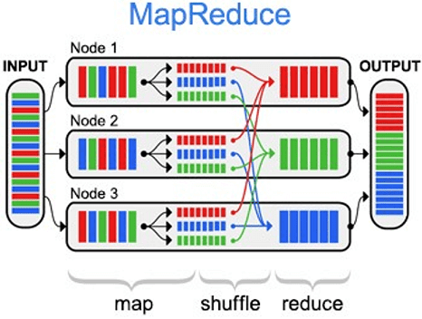

# Домашнее задание к занятию 11.1. «Базы данных, их типы» - `Юрий Чеканов`

### Задание 1. СУБД

### Кейс
Крупная строительная компания, которая также занимается проектированием и девелопментом, решила создать 
правильную архитектуру для работы с данными. Ниже представлены задачи, которые необходимо решить для
каждой предметной области. 

Какие типы СУБД, на ваш взгляд, лучше всего подойдут для решения этих задач и почему? 

1.1. Бюджетирование проектов с дальнейшим формированием финансовых аналитических отчётов и прогнозирования рисков.
СУБД должна гарантировать целостность и чёткую структуру данных.

**<u>Ответ:</u>**

**Реляционная база** данных идеально подходит для хранения структурированных данных и обеспечивает защищиту данных от потери и повреждения благодаря поддержки четырех свойств ACID:

- **Атомарность** означает, что каждая транзакция (последовательность из одной или нескольких операций SQL) рассматривается как единое целое. Она может завершиться удачно или неудачно только целиком: если одна из операций завершается неудачно, вся транзакция завершается неудачно. Когда пользователь покупает товар, деньги снимаются с его счета и переводятся на счет продавца. Атомарность гарантирует, что, если транзакция для пополнения счета заканчивается неудачно, операция снятия средств не выполняется. 
- **Согласованность** означает, что в базу данных можно записывать только достоверные данные, соответствующие всем правилам. Если вводимые данные недостоверны, база данных возвращается в состояние, предшествующее транзакции. Это гарантирует, что незаконные транзакции не смогут повредить базу данных. 
- **Изолированность** означает, что незавершенные транзакции остаются изолированными. Это обеспечивает независимую и безопасную обработку всех транзакций. 
- **Прочность** означает, что система сохраняет данные даже в случае неуспешной транзакции. Таким образом, данные не потеряются, даже если система выйдет из строя.

​				

**Примеры реляционных баз данных**, которые можно использовать для решения этой задачи:

**MySQL, PostgreSQL, Oracle, MS SQL Server.**

1.1.* Хеширование стало занимать длительно время, какое API можно использовать для ускорения работы? 

**<u>Ответ:</u>**

Хеш-адресацией или хеш-индексированием называется технология быстрого прямого доступа к хранимой записи на основе значения обычного числового поля. Использование БД типа "ключ-значение" для кеширования данных  позволяет повысить производительность хеширования. Всякого рода индексирование, в том числе битовые индексы, предполагают наличие ещё одного файла: для десктоповских СУБД – физического, для SQL-сервера – логического (находящегося в одном физическом), а хеширование не требует дополнительного файла. Данные хранятся в памяти, позволяют быстро осуществлять поиск, например высокопроизводительным двоичным поиском. 

Примером таких БД могут быть  [Redis](https://redis.io/), [DynamoDB ](https://aws.amazon.com/dynamodb/) от Amazon, [Memcache](https://memcached.org) 

1.2. Под каждый девелоперский проект создаётся отдельный лендинг, и все данные по лидам стекаются в CRM к маркетологам и менеджерам по продажам. Какой тип СУБД лучше использовать для лендингов и для CRM? 
СУБД должны быть гибкими и быстрыми.

**<u>Ответ:</u>**

Устоявшимся стандартом для построения CRM систем являються реляционные БД. (**MySQL, PostgreSQL, Oracle, MS SQL Server.**)

1.2.* Можно ли эту задачу закрыть одной СУБД? И если да, то какой именно СУБД и какой реализацией?

**<u>Ответ:</u>**

Думаю задача решаема на основе реляционной БД. Для для больших объемов данных и запросов потребуестя хеш-индексирование, которое реализуестся с использованием таких БД как [Redis](https://redis.io/), [DynamoDB ](https://aws.amazon.com/dynamodb/) от Amazon, [Memcache](https://memcached.org) 

Пример реализации Bitrix24:

1.3. Отдел контроля качества решил создать базу по корпоративным нормам и правилам, обучающему материалу и так далее, сформированную согласно структуре компании. СУБД должна иметь простую и понятную структуру.

**<u>Ответ:</u>**

**Документарная БД**, например [MongoDB ](https://www.mongodb.com/)и [Couchbase](https://www.couchbase.com/)

Благодаря своей структуре и гибкости документно-ориентированные базы данных обычно используются для управления контентом, быстрого создания прототипов и анализа данных.

1.3.* Можно ли под эту задачу использовать уже существующую СУБД из задач выше и если да, то как лучше это реализовать? 

**<u>Ответ:</u>**

Решением для быстрого развертования и с низкой стоимостью внедрения могуть быть **облачные решения**. 

Например Yandex Wiki

1.4. Департамент логистики нуждается в решении задач по быстрому формированию маршрутов доставки материалов по объектам и распределению курьеров по маршрутам с доставкой документов. СУБД должна уметь быстро работатьсо связями.

**<u>Ответ:</u>**

**Графовое хранилище** - в графовом хранилище каждая структурная единица, называемая узлом, представляет собой изолированный документ с данными произвольной формы. Узлы соединены ребрами, которые определяют связи между ними.

**<u>Ответ:</u>**

Графовые базы данных оптимизированы для проектов с графовыми структурами данных, таких как социальные сети и семантическая паутина. [Neo4J](https://neo4j.com/) и[ Datastax Enterprise](https://www.datastax.com/products/datastax-enterprise) — лучшие образцы графовых баз данных. 

1.4.* Можно ли к этой СУБД подключить отдел закупок или для них лучше сформировать свою СУБД в связке с СУБД логистов?

**<u>Ответ:</u>**

Лучше своя реляционная БД. 

1.5.* Можно ли все перечисленные выше задачи решить, используя одну СУБД? Если да, то какую именно?

**<u>Ответ:</u>** Думаю все можно реализовать в реляционной БД. 

Выбор СУБД зависит от проекта, который требуется реализовать, а также от наличия реурсов ддля его реализации. 

Примеры использования СУБД для разных задач:

| **№** | **Тип СУБД**  | **Когда выбирать**                                           | **Популярные СУБД**                                          |
| ----- | ------------- | :----------------------------------------------------------- | :----------------------------------------------------------- |
| 1     | Реляционные   | Нужна транзакционность; высокая нормализация; большая доля операций на вставку | Oracle, MySQL, Microsoft SQL Server, PostgreSQL, IBM DB2, SQLite |
| 2     | Ключ-значение | Задачи кэширования и брокеры сообщений                       | Redis, Memcached, etcd                                       |
| 3     | Документные   | Для хранения объектов в одной сущности, но с разной структурой; хранение структур на основе JSON | Couchbase, MongoDB, Amazon DocumentDB                        |
| 4     | Графовые      | Задачи подобные социальным сетям; системы оценок и рекомендаций | Neo4j, Amazon Neptune, InfiniteGraph, TigerGraph             |
| 5     | Колоночные    | Хранилища данных; выборки со сложными аналитическими вычислениями; количество строк в таблице превышает сотни миллионов | Vertica, ClickHouse, Google BigQuery, Sybase \ SAP IQ, InfoBright |
| 6     | Time series   | Системы мониторинга, сбора телеметрии, и финансовые системы, с привязкой к временным меткам или временным рядам | InfluxDB, Kdb+, Prometheus, TimescaleDB, QuestDB, AWS Timestream, OpenTSDB, GridDB |
| 7     | Объектные     | Высокопроизводительная обработка данных, имеющих сложную структуру, с использованием языков объектно ориентированного программирования | MongoDB Realm, InterSystems Caché, ObjectStore, Actian NoSQL DB, Objectivity/DB |
| 8     | Search engine | Системы полнотекстового поиска                               | Apache Solr, Elasticsearch, Splunk                           |
| 9     | Spatial       | GIS-решения, работа с геометрическими объектами              | Oracle Spatial, Microsoft SQL, PostGIS, SpatialLite          |

---

### Задание 2. Транзакции

2.1. Пользователь пополняет баланс счёта телефона, распишите пошагово, какие действия должны произойти для того, чтобы транзакция завершилась успешно. Ориентируйтесь на шесть действий.

**<u>Ответ:</u>**

1. Найти запись с данными о балансе
2. Заблокировать для других транзакций
3. Прочитать баланс
4. Внести новые данные о балансе
5. Сохранить данные в БД
6. Отключиться/разблокировать данные

2.1.* Какие действия должны произойти, если пополнение счёта телефона происходило бы через автоплатёж?

**<u>Ответ:</u>** Те же действия 

---

### Задание 3. SQL vs NoSQL

3.1. Напишите пять преимуществ SQL-систем по отношению к NoSQL. 

**<u>Ответ:</u>**

1. Atomicity, или атомарность — ни одна транзакция не будет зафиксирована в системе частично.
2. Consistency, или непротиворечивость — фиксируются только допустимые результаты транзакций.
3. Isolation, или изолированность — на результат транзакции не влияют транзакции, проходящие параллельно ей.
4. Durability, или долговечность — изменения в базе данных сохраняются несмотря на сбои или действия пользователей.
5. Более универсальные, чем NoSQL
6. Большая база знаний

3.1.* Какие, на ваш взгляд, преимущества у NewSQL систем перед SQL и NoSQL.

**<u>Ответ:</u>**

Классификация основана на различных подходах, принятых сохранить SQL интерфейс, а также решить масштабируемость и производительность, являющиеся проблемами традиционных решений OLTP. Сохраняя подержку транзакций ACID лучше превосходит по следующим параметрам:

1. Производительность
2. Масштабируемость
3. Кластеризация

---

### Задание 4. Кластеры

Необходимо производить большое количество вычислений при работе с огромным количеством данных, под эту задачу выделено 1000 машин. 

На основе какого критерия будете выбирать тип СУБД и какая модель *распределённых вычислений* 
здесь справится лучше всего и почему?

**<u>Ответ:</u>**

1. возможность работы с огромным массивом данных
2. Масштабируемость
3. Надежность
4. Поддержка распределенных вычислений
5. Поддержка объектных хранилищ данных
6. SQL

Возможное решение:

Apache Hadoop + Apache Hive

 Модель распределённых вычислений **MapReduce**

MapReduce можно по праву назвать главной технологией Big Data, т.к. она изначально ориентирована на параллельные вычисления в распределенных кластерах. Суть MapReduce состоит в разделении информационного массива на части, параллельной обработки каждой части на отдельном узле и финального объединения всех результатов.

Программы, использующие MapReduce, автоматически распараллеливаются и исполняются на распределенных узлах кластера, при этом исполнительная система сама заботится о деталях реализации (разбиение входных данных на части, разделение задач по узлам кластера, обработка сбоев и сообщение между распределенными компьютерами). Благодаря этому программисты могут легко и эффективно использовать ресурсы распределённых Big Data систем.

Технология практически универсальна: она может использоваться для индексации веб-контента, подсчета слов в большом файле, счётчиков частоты обращений к заданному адресу, вычисления объём всех веб-страниц с каждого URL-адреса конкретного хост-узла, создания списка всех адресов с необходимыми данными и прочих задач обработки огромных массивов распределенной информации. Также к областям применения MapReduce относится распределённый поиск и сортировка данных, обращение графа веб-ссылок, обработка статистики логов сети, построение инвертированных индексов, кластеризация документов, машинное обучение и статистический машинный перевод. Также MapReduce адаптирована под многопроцессорные системы, добровольные вычислительные, динамические облачные и мобильные среды. 

---

