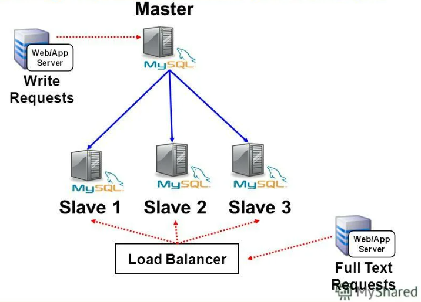
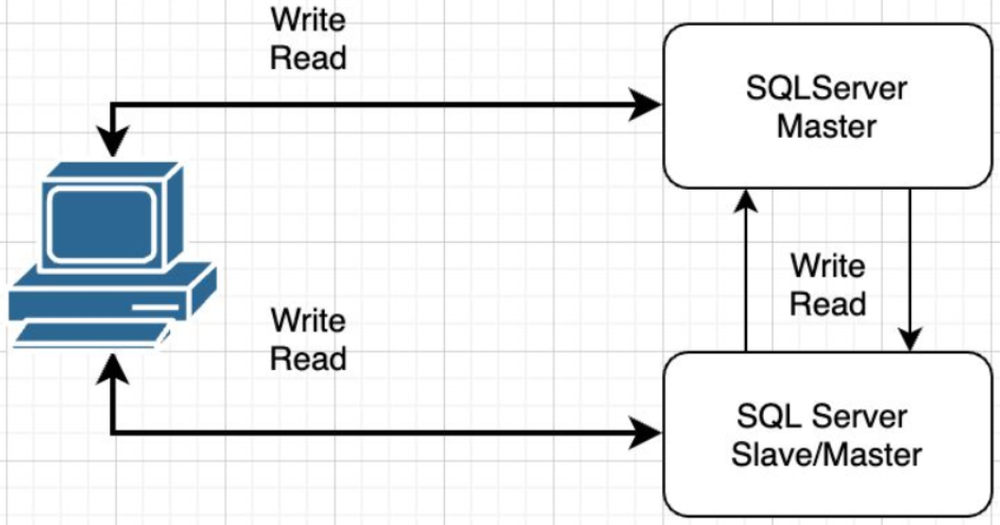
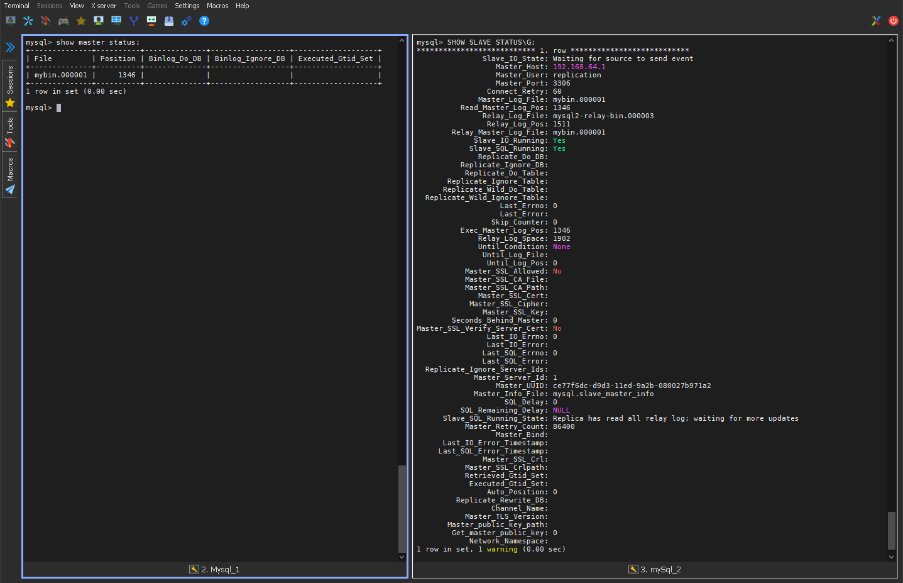
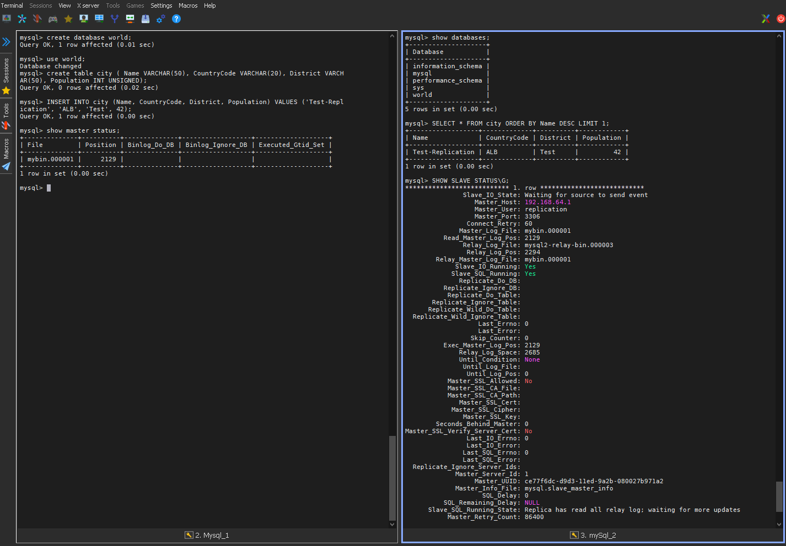
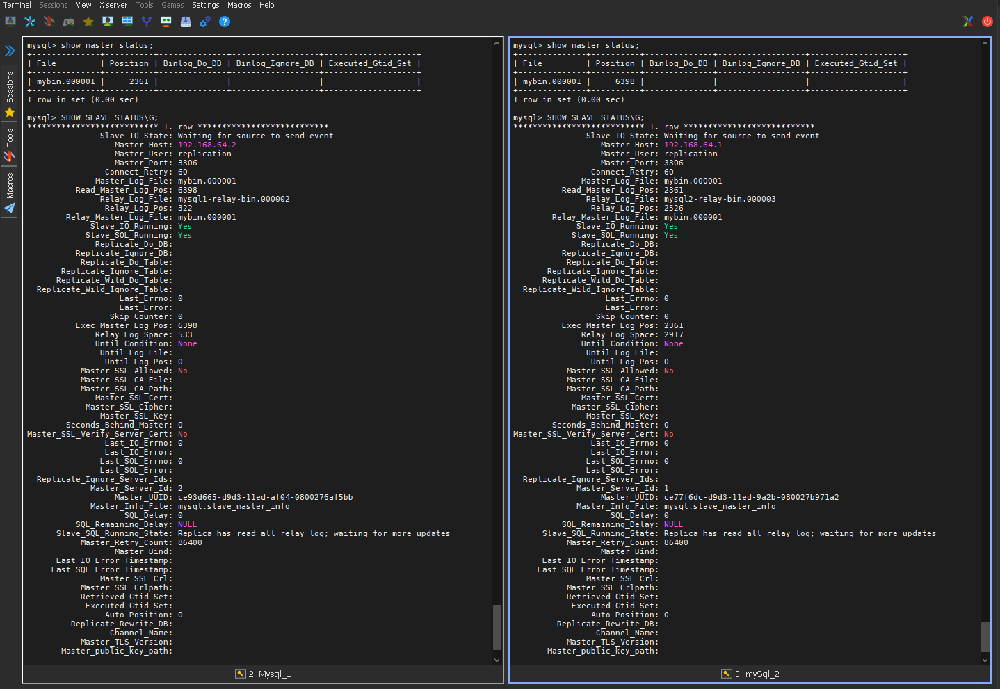
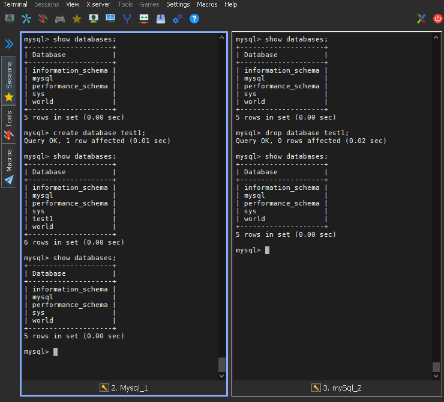

# Домашнее задание к занятию «Репликация и масштабирование. Часть 1» - `Юрий  Чеканов`

### Задание 1

На лекции рассматривались режимы репликации master-slave, master-master, опишите их различия.

*Ответить в свободной форме.*

Пример master-slave конфигурации:



Пример master-master конфигурации:



Основное различие в том, что при мастер-мастер можем писать и читать на оба мастера, а при мастер-слейв пишем на мастер читать можем с обеих, но обычно со слейв. 

Конфигурация мастер-мастер опасна при нарушении репликации - понять где верные данные будет сложно, восстановление  данных очень трудозатратно. 

------

### Задание 2

Выполните конфигурацию master-slave репликации, примером можно пользоваться из лекции.

*Приложите скриншоты конфигурации, выполнения работы: состояния и режимы работы серверов.*





**host mysql1** <u>mysqld.cnf</u> 

```ini
[mysqld]
pid-file        = /var/run/mysqld/mysqld.pid
socket          = /var/run/mysqld/mysqld.sock
datadir         = /var/lib/mysql
log-error       = /var/log/mysql/error.log

bind-address=0.0.0.0
server-id=1
log_bin=/var/log/mysql/mybin.log
```

**host mysql1** <u>mysqld.cnf</u> 

```ini
[mysqld]
pid-file        = /var/run/mysqld/mysqld.pid
socket          = /var/run/mysqld/mysqld.sock
datadir         = /var/lib/mysql
log-error       = /var/log/mysql/error.log

bind-address=0.0.0.0
server-id=2
log_bin=/var/log/mysql/mybin.log
```


------

### Задание 3*

Выполните конфигурацию master-master репликации. Произведите проверку.

*Приложите скриншоты конфигурации, выполнения работы: состояния и режимы работы серверов.*



