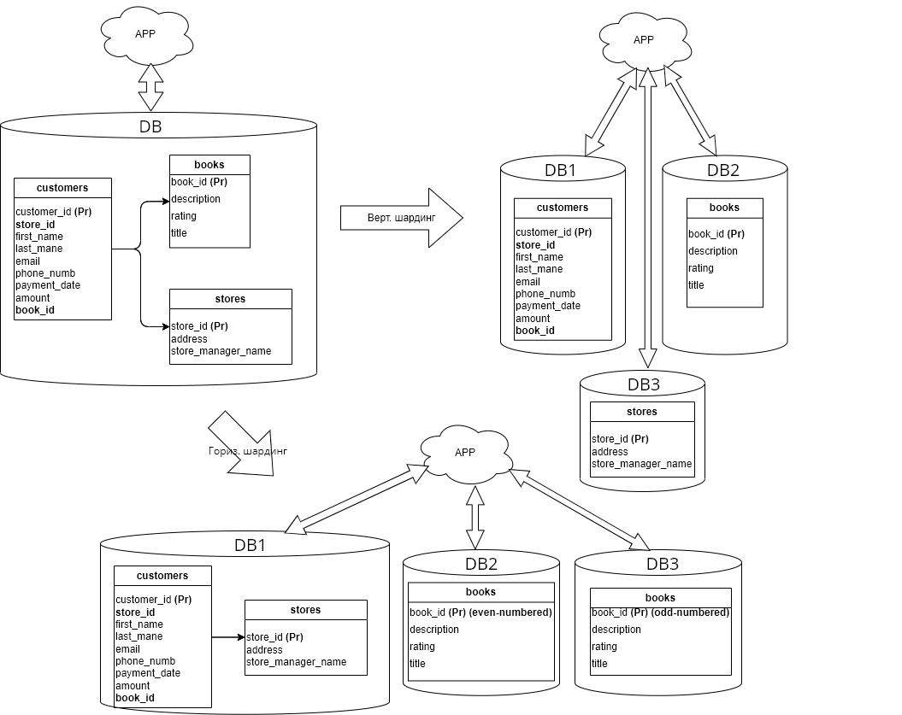

# Домашнее задание к занятию «Репликация и масштабирование. Часть 2» - `Юрий Чеканов`

### Задание 1

Опишите основные преимущества использования масштабирования методами:

- активный master-сервер и пассивный репликационный slave-сервер;
- master-сервер и несколько slave-серверов;
- активный сервер со специальным механизмом репликации — distributed replicated block device (DRBD);
- SAN-кластер.

*Дайте ответ в свободной форме.*

**Активный master-сервер и пассивный репликационный slave-сервер:**

1. Повышение надежности ранения данных: все данные, находящиеся на master-сервере, дублируются на slave-сервере. В случае выхода из строя master-сервера данные не будут потеряны.
2. Повышение доступности данных - данные можно читать с master и slave. 
3. Возможность проведения регламентных работ без прерывания доступности. 

**Master-сервер и несколько slave-серверов:**

Все преимущества описанные выше и дополнительно:

1. Увеличение производительности: распределение задач между несколькими slave-серверами и master-сервером позволяет увеличить производительность всей системы.
2. Сокращение времени ответа: если данные распределены между несколькими серверами, то это позволит сократить время ответа системы на запросы пользователей.

**Активный сервер со специальным механизмом репликации — distributed replicated block device (DRBD):**

1. Обеспечение отказоустойчивости: DRBD позволяет обеспечить отказоустойчивость, так как осуществляется репликация данных на другой сервер или в другое хранилище.
2. Надежность: использование DRBD увеличивает надежность всей системы, так как данные сохраняются на нескольких серверах или хранилищах.

**SAN-кластер:**

1. Увеличение масштабируемости: SAN-кластер позволяет увеличивать масштабирование системы до нескольких серверов и хранилищ.
2. Оптимизация обработки данных: использование SAN-кластера позволяет оптимизировать обработку данных, так как данные могут обрабатываться параллельно на нескольких узлах кластера.

------

### Задание 2

Разработайте план для выполнения горизонтального и вертикального шаринга базы данных. База данных состоит из трёх таблиц:

- пользователи,
- книги,
- магазины (столбцы произвольно).

Опишите принципы построения системы и их разграничение или разбивку между базами данных.

*Пришлите блок-схему, где и что будет располагаться. Опишите, в каких режимах будут работать сервера.*

Для горизонтального и вертикального шардинга базы данных можно использовать следующий план:

1. Горизонтальный шардинг базы данных

   - Разбить таблицы на несколько частей по ключу (например четные/нечетные).
   - Создать несколько серверов базы данных и распределить части таблиц между ними (структура таблиц аналогичная).
   - Разработать механизм для балансировки нагрузки между серверами.
   - Реализовать механизм для синхронизации изменений между серверами.

   

2. Вертикальный шардинг базы данных

   - Разбить таблицы на несколько частей по столбцам (например, разделить таблицу пользователей на таблицы с персональными данными и таблицы с данными о покупках) или разместить таблицы в разных БД .

   - Создать несколько серверов базы данных и распределить таблицы между ними.

   - Разработать механизм для балансировки нагрузки между серверами.

   - Реализовать механизм для синхронизации изменений между серверами.

В режиме нормальной работы балансировщик распределяет запросы между серверами базы данных, обеспечивая балансировку нагрузки. В случае отказа одного из серверов, запросы перенаправляются на другие доступные серверы.

Кроме того, в рамках вертикального шардинга можно использовать master-master репликацию, когда каждый сервер получает и записывает данные со всех таблиц, но отвечает только за определенный набор столбцов в каждой таблице. Это позволяет балансировать нагрузку по столбцам и обеспечивать высокую доступность данных, так как каждый сервер является полным дубликатом другого.

[Учебное пособие по MYSQL Sharding](https://questu.ru/articles/33379/)

------

### Задание 3*

Выполните настройку выбранных методов шардинга из задания 2.

*Пришлите конфиг Docker и SQL скрипт с командами для базы данных*.