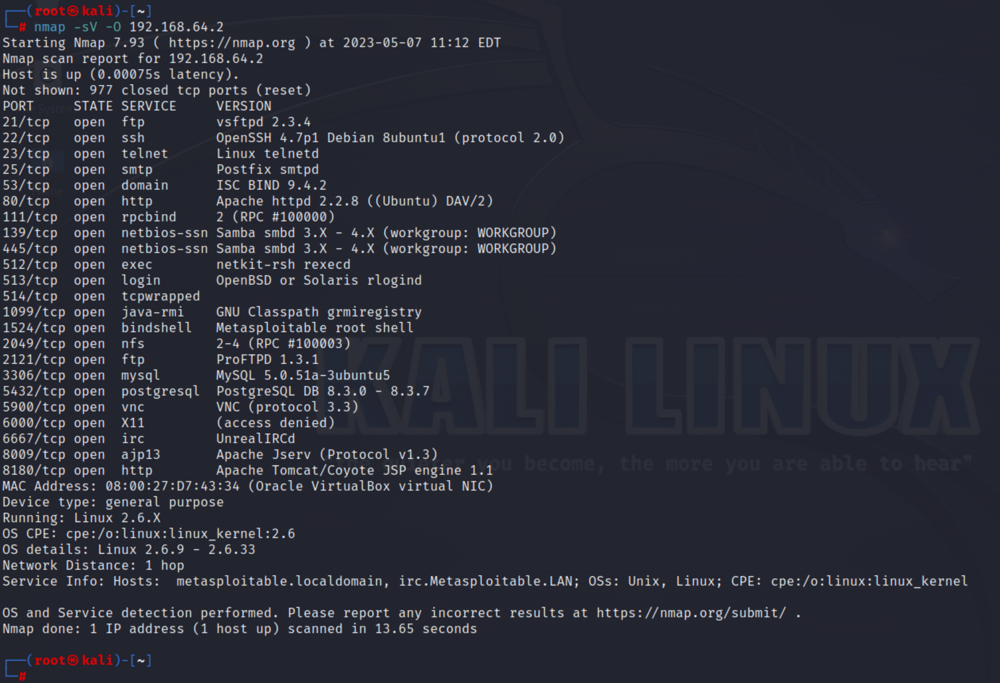
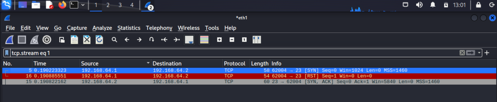
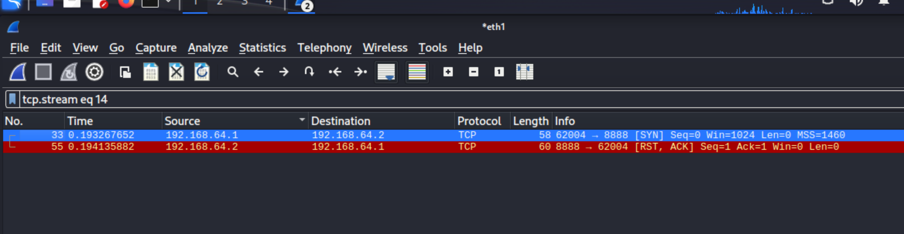
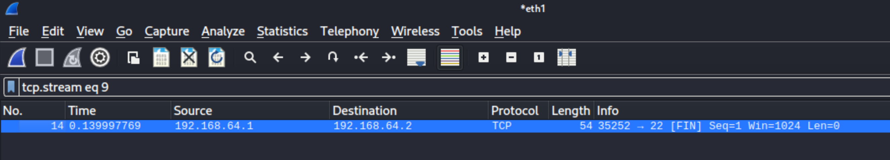
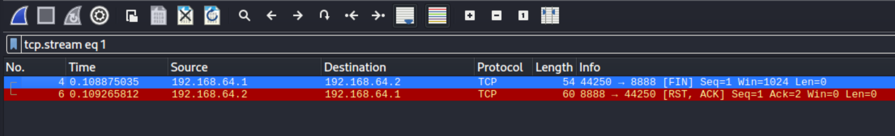
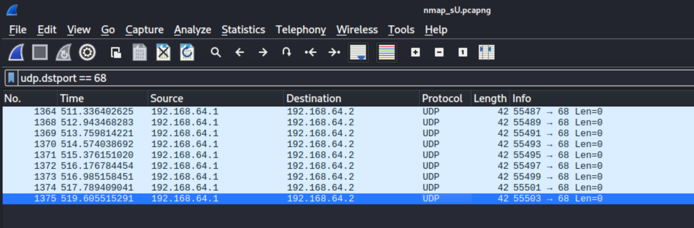
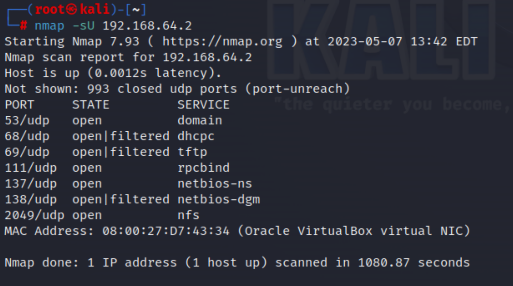

# Домашнее задание к занятию «Уязвимости и атаки на информационные системы» - `Юрий Чеканов`

### Задание 1

Скачайте и установите виртуальную машину Metasploitable: https://sourceforge.net/projects/metasploitable/.

Это типовая ОС для экспериментов в области информационной безопасности, с которой следует начать при анализе уязвимостей.

Просканируйте эту виртуальную машину, используя **nmap**.

Попробуйте найти уязвимости, которым подвержена эта виртуальная машина.

Сами уязвимости можно поискать на сайте https://www.exploit-db.com/.

Для этого нужно в поиске ввести название сетевой службы, обнаруженной на атакуемой машине, и выбрать подходящие по версии уязвимости.

Ответьте на следующие вопросы:

- Какие сетевые службы в ней разрешены?

  

- Какие уязвимости были вами обнаружены? (список со ссылками: достаточно трёх уязвимостей)

  [vsftpd 2.3.4 - Backdoor Command Execution](https://www.exploit-db.com/exploits/17491)

  [OpenSSH Forwarded Unix Domain Sockets Privilege Escalation](https://www.exploit-db.com/exploits/40962)

  [ISC BIND 9 - TKEY (PoC)](https://www.exploit-db.com/exploits/37721)

  [ProFTPd  Remote Command Execution](https://www.exploit-db.com/exploits/15449)

### Задание 2

Проведите сканирование Metasploitable в режимах SYN, FIN, Xmas, UDP.

Запишите сеансы сканирования в Wireshark.

Ответьте на следующие вопросы:

- Чем отличаются эти режимы сканирования с точки зрения сетевого трафика?
- Как отвечает сервер?

<u>**SYN:**</u>

​	В этом режиме nmap посылает SYN пакет, как если бы вы хотел установить реальное соединение и ждет. Ответы SYN/ACK указывают на то, что порт прослушивается (открыт), а RST (сброс) на то, что не прослушивается. Если после нескольких запросов не приходит никакого ответа, то порт помечается как фильтруемый. Порт также помечается как фильтруемый, если в ответ приходит ICMP сообщение об ошибке недостижимости (тип 3, код 1,2, 3, 9, 10 или 13).

​	Наиболее популярный тип сканирования - способен сканировать тысячи портов в секунду при быстром соединении, его работе не препятствуют ограничивающие бранмауэры. Этот тип сканирования относительно ненавящив и незаметен, т.к. при таком сканировании TCP соединение никогда не устанавливается до конца. Он работает с любым TCP стеком, не завися от каки-либо особенностей специфичной платформы, как это происходит при сканированиях типа FIN/NULL/Xmas, Maimon и idle сканировании. Он также предоставляет ясную и достоверную дифференциацию между состояниями `открыт`, `закрыт` и `фильтруется`.

<u>**FIN, Xmas:**</u>

​	Эти типы сканирования работают по одной схеме, различия только в TCP флагах установленных в пакетах запросов. Если в ответ приходит RST пакет, то порт считается `закрытым`, отсутствие ответа означает, что порт `открыт|фильтруется`. Порт помечается как `фильтруется`, если в ответ приходит ICMP ошибка о недостижимости (тип 3, код 1, 2, 3, 9, 10 или 13).

​	Ключевой особенностью этих типов сканирования является их способность незаметно обойти некоторые не учитывающие состояние (non-stateful) брандмауэры и роутеры с функцией пакетной фильтрации. Еще одним преимуществом является то, что они даже чуть более незаметны, чем SYN сканирование. Все же не надо на это полагаться - большинство современных IDS могут быть сконфигурированы на их обнаружение. Большим недостатком является то, что не все системы следуют RFC 793 дословно. Некоторые системы посылают RST ответы на запросы не зависимо от того, открыт порт или закрыт. Это приводит к тому, что все порты помечаются как `закрытые`. Основными системами ведущими себя подобным образом являются Microsoft Windows, многие устройства Cisco, BSDI и IBM OS/400. Хотя такое сканирование применимо к большинству систем, основанных на Unix. Еще одним недостатком этих видов сканирования является их неспособность разделять порты на `открытые` и `фильтруемые`, т.к. порт помечается как `открыт|фильтруется`.

**<u>UDP:</u>**

​	UDP сканирование работает путем посылки пустого (без данных) UDP заголовка на каждый целевой порт. Если в ответ приходит ICMP ошибка о недостижимости порта (тип 3, код 3), значит порт `закрыт`. Другие ICMP ошибки недостижимости (тип 3, коды 1, 2, 9, 10 или 13) указывают на то, что порт `фильтруется`. Иногда, служба будет отвечать UDP пакетом, указывая на то, что порт `открыт`. Если после нескольких попыток не было получено никакого ответа, то порт классифицируется как `открыт|фильтруется`. Это означает, что порт может быть открыт, или, возможно, пакетный фильтр блокирует его. Функция определения версии (`-sV`) может быть полезна для дифференциации действительно открытых портов и фильтруемых.

​	Большой проблемой при UDP сканировании является его медленная скорость работы. Открытые и фильтруемые порты редко посылают какие-либо ответы, заставляя Nmap отправлять повторные запросы, на случай если пакеты были утеряны. Закрытые порты часто оказываются еще большей проблемой. Обычно они в ответ возвращают ICMP ошибку о недостижимости порта. Но в отличии от RST пакетов отсылаемых закрытыми TCP портами в ответ на SYN или сканирование с установкой соединения, многие хосты ограничивают лимит ICMP сообщений о недостижимости порта по умолчанию. Linux и Solaris особенно строги в этом плане. Например, ядро Linux 2.4.20 огранивает количество таких сообщений до одного в секунду (в `net/ipv4/icmp.c`).

Результаты работы nmap:

<u>Useful links:</u>

[nmap 50 essential commands](https://ciksiti.com/ru/chapters/5561-50-essential-nmap-commands-for-system-admins)

[Various port scanning techniques](https://nmap.org/man/ru/man-port-scanning-techniques.html)

[Port Scanning Techniques By Using Nmap](https://www.geeksforgeeks.org/port-scanning-techniques-by-using-nmap/)