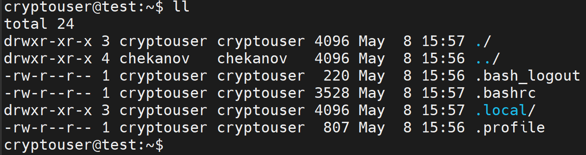
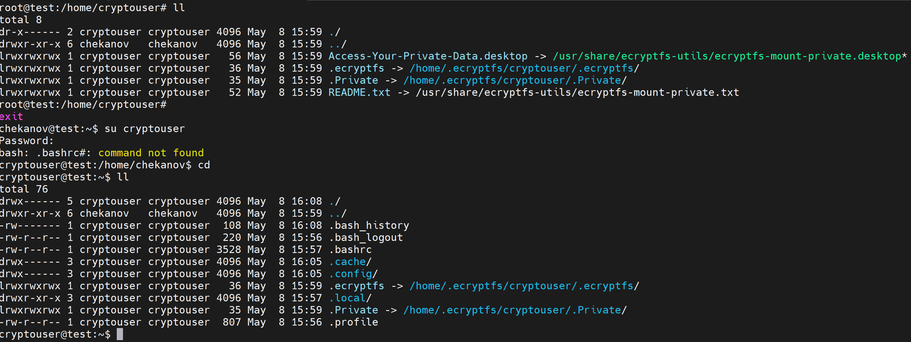
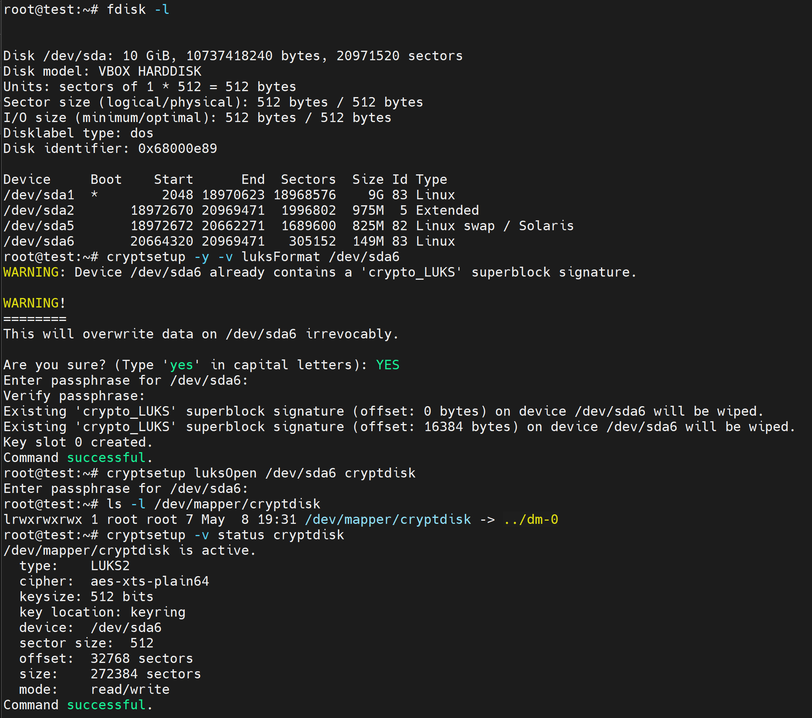
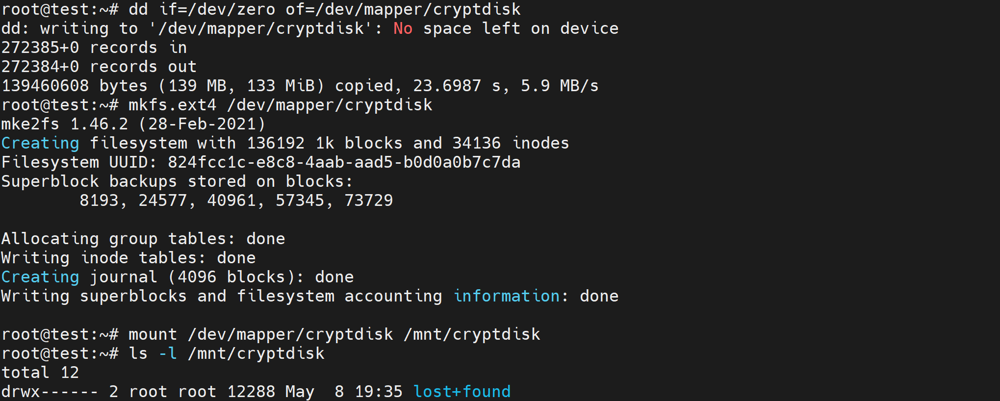
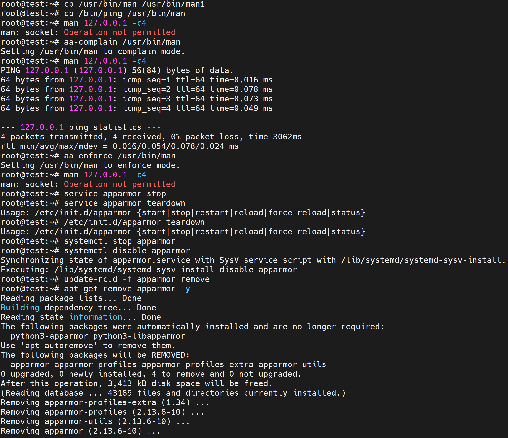
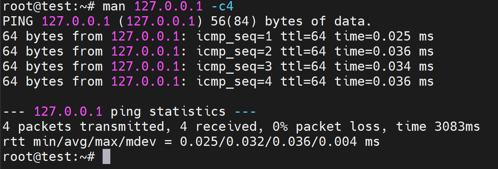

# Домашнее задание к занятию «Защита хоста» - `Юрий Чеканов`

### Задание 1

1. Установите **eCryptfs**.
2. Добавьте пользователя cryptouser.
3. Зашифруйте домашний каталог пользователя с помощью eCryptfs.

*В качестве ответа пришлите снимки экрана домашнего каталога пользователя с исходными и зашифрованными данными.*

**<u>Useful links:</u>**

[eCryptfs на Linux](https://itsecforu.ru/2020/06/06/🐧-как-зашифровать-каталоги-с-помощью-ec/)

[Encrypting a home directory](https://toadmin.ru/как-зашифровать-домашнюю-папку-в-linux/)

### Задание 2

1. Установите поддержку **LUKS**.
2. Создайте небольшой раздел, например, 100 Мб.
3. Зашифруйте созданный раздел с помощью LUKS.

*В качестве ответа пришлите снимки экрана с поэтапным выполнением задания.*

**<u>Useful links:</u>**

[LUKS installation](https://losst.pro/shifrovanie-diskov-v-linux)

[LUKS man page](https://manpages.debian.org/buster/cryptsetup-bin/cryptsetup.8.en.html)

Задание 3 *

1. Установите **apparmor**.
2. Повторите эксперимент, указанный в лекции.
3. Отключите (удалите) apparmor.

**After rebooting:**

*В качестве ответа пришлите снимки экрана с поэтапным выполнением задания.*